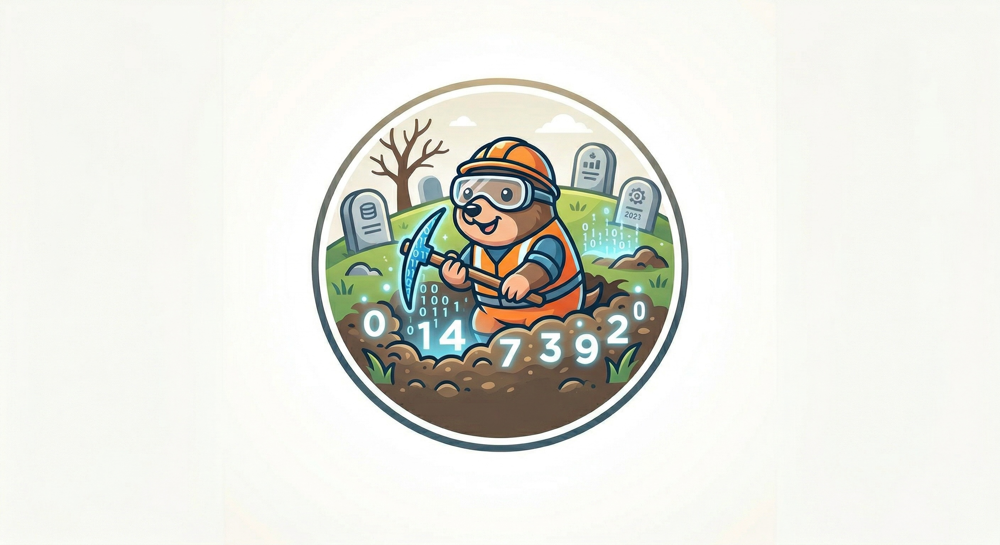

# Grave Catalogue Extraction – Master's Thesis

Automated extraction and matching of grave records from archaeological PDF catalogues. The project is split into two sequential pipelines: the **text pipeline** produces a structured extraction table from the catalogue text, and the **image pipeline** enriches it with visual information by extracting and matching embedded figures and plates to the corresponding grave entities.

---

## Overview

```
text_pipeline/      → extracts structured grave records from catalogue text (PDF → CSV)
image_pipeline/     → extracts figures and plates from the catalogue PDF, segments plates
                       into sub-images, and matches them to the records produced by the
                       text pipeline (CSV → CSV with matched_filenames)
```

```
PDF Catalogues
     │
     ▼
┌──────────────────────────────────────────────────────────────┐
│  1 · Text Pipeline  (text_pipeline/)                         │
│                                                              │
│  PDF → headers → hierarchy → sections                        │
│      → LLM grave extraction → grave records (CSV)            │
└──────────────────────┬───────────────────────────────────────┘
                       │  grave_extract.csv
                       ▼
┌──────────────────────────────────────────────────────────────┐
│  2 · Image Pipeline  (image_pipeline/)                       │
│                                                              │
│  PDF → image extraction + caption assignment                 │
│      → routing (figures vs. plates)                          │
│      → plate segmentation (Mask R-CNN)                       │
│      → matching (A1-MLLM or A2-OOL)                          │
│      → grave records enriched with image file paths          │
└──────────────────────────────────────────────────────────────┘
```

---

## 1 · Text Pipeline (`text_pipeline/`)

Parses the PDF structure (headers → hierarchy → sections) and then runs an LLM agent to extract structured grave data from each section.

**Output:** `grave_extract.csv` – one row per grave with structured fields (location, rite, gender, age, grave goods, …)

→ See `[text_pipeline/README.md](text_pipeline/README.md)` for setup and usage.

---

## 2 · Image Pipeline (`image_pipeline/`)

Takes the catalogue PDFs and the `grave_extract.csv` produced by the text pipeline and enriches them with matching grave images. The pipeline distinguishes between two types of visual elements:

- **Figures** (*Abbildungen*) – simple images embedded in the running text, matched directly via regex.
- **Plates** (*Tafeln*) – complex graphics at the end of the catalogue composed of multiple sub-images. These require segmentation (Mask R-CNN) before matching.

For plate matching, two competing strategies were implemented and evaluated:


| Strategy    | Approach                                                                       |
| ----------- | ------------------------------------------------------------------------------ |
| **A1-MLLM** | Sends the sub-image directly to a multimodal large language model for matching |
| **A2-OOL**  | Object detection (Faster R-CNN) → OCR (EasyOCR / Tesseract) → LLM reasoning    |


**Input:** PDF catalogue + `grave_extract.csv` from the text pipeline
**Output:** modified `grave_extract.csv` with a new `matched_filenames` column containing the paths of the assigned image files

→ See `[image_pipeline/README.md](image_pipeline/README.md)` for setup and usage.

---

## Setup

Each pipeline manages its own dependencies via [uv](https://docs.astral.sh/uv/getting-started/installation/). Install them independently:

```bash
cd text_pipeline && uv sync
cd image_pipeline && uv sync
```

Both pipelines require API keys for LLM providers. Copy `.env.example` to `.env` in the respective directory and fill in the keys.

---

## Docker

Each pipeline can be run in a container. Build from the **pipeline directory** so the Dockerfile and dependencies are in context.

**Text pipeline:**

```bash
docker build -t text-pipeline text_pipeline/

docker run --env-file text_pipeline/.env \
  -v $(pwd)/text_pipeline/data:/app/data \
  -v $(pwd)/text_pipeline/outputs:/app/outputs \
  text-pipeline \
  --pdf-path "data/Grabfunde_Teil 1.pdf" \
  --output-dir outputs/my-run \
  --model mistral-large-3-675b-instruct-2512 \
  --provider gwdg
```

**Image pipeline:**

Mount data, output, and model weight directories. The example uses the segmentation model trained on the first catalogue only.

```bash
docker build -t image-pipeline image_pipeline/

docker run --env-file image_pipeline/.env \
  -v $(pwd)/image_pipeline/data:/app/data \
  -v $(pwd)/image_pipeline/grave_image_matching/output:/app/grave_image_matching/output \
  -v $(pwd)/image_pipeline/tafel_segmentation_model/output_train_only_first_catalogue:/app/tafel_segmentation_model/output_train_only_first_catalogue:ro \
  -v $(pwd)/image_pipeline/tafel_subbox_id_extraction_model/output:/app/tafel_subbox_id_extraction_model/output:ro \
  image-pipeline \
  --pdf-path "data/Grabfunde_Teil 1.pdf" \
  --graves-csv data/grave_extract.csv \
  --output-dir grave_image_matching/output \
  --model mistral-large-3-675b-instruct-2512 \
  --seg-model-dir tafel_segmentation_model/output_train_only_first_catalogue
```

