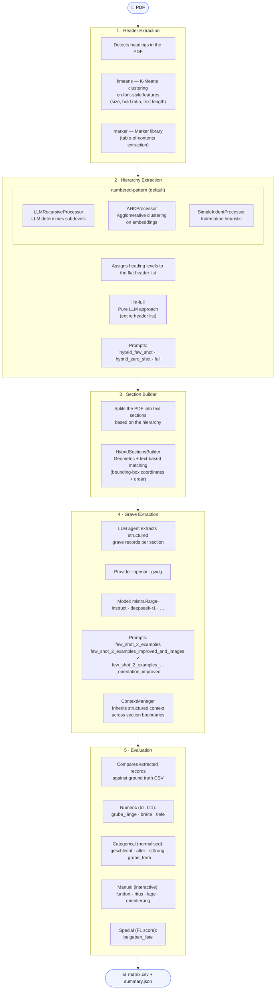

# Grave Extraction Pipeline

Automated extraction of grave records from PDF archaeological grave catalogues.
The pipeline parses the PDF structure (headers → hierarchy → sections) and then runs an LLM agent to extract structured grave data from each section.

<p align="center">
  
</p>


---

## Setup

Requires [uv](https://docs.astral.sh/uv/getting-started/installation/).

```bash
# Install project dependencies
uv sync
```

Copy `.env.example` to `.env` and fill in your API keys:

```
OPENAI_API_KEY=...
GWDG_API_KEY=...
```

---

## Tracing (optional)

The pipeline integrates with [Arize Phoenix](https://phoenix.arize.com/) for LLM call tracing. If Phoenix is running locally, traces are sent automatically. If it is not running, a warning is logged and the pipeline continues without tracing.

```bash
# Start Phoenix (in a separate terminal)
uv run phoenix serve
```

Phoenix UI is available at `http://localhost:6006`.

---

## Pipeline

The pipeline consists of five sequential stages. Each stage can be run independently via a script, or the full pipeline can be run in one go.

```
PDF → headers → hierarchy → sections → grave extraction → evaluation
```

<details>
<summary><strong>Pipeline flow diagram (with implementations)</strong></summary>



</details>

### 1. Header Extraction

Extracts headings from the PDF using font-style K-Means clustering or marker.

```bash
uv run python scripts/run_header_extraction.py \
  --pdf-path data/Grabfunde_text_only.pdf \
  --output-dir outputs/experiments/header-extraction \
  --strategy kmeans   # or: marker (uses marker, see https://github.com/datalab-to/marker)
```

Outputs: `style_clustering_k_means.json`, `style_clustering_k_means.txt`, `cluster_plot.png`

---

### 2. Hierarchy Extraction

Assigns heading levels to the flat header list using a numbered-pattern parser backed by an LLM for unnumbered blocks.

```bash
uv run python scripts/run_hierarchy_extraction.py \
  --headers-file outputs/experiments/header-extraction/style_clustering_k_means.json \
  --output-dir outputs/experiments/hierarchy-extraction \
  --model deepseek-r1 \
  --prompt-file extract_hierarchy_hybrid_few_shot \
  --run-name my_run
```

Available prompts (in `prompts/hierarchy-extraction/`): `extract_hierarchy_hybrid_few_shot`, `extract_hierarchy_hybrid_zero_shot`, `extract_hierarchy_full`

> **`marker` strategy** uses [marker](https://github.com/datalab-to/marker) to extract the table of contents. Requires the Marker models to be downloaded on first run.

Outputs: `<run-name>.json`, `<run-name>.txt`

---

### 3. Section Builder

Splits the PDF into text sections based on the extracted hierarchy.

```bash
uv run python scripts/run_section_builder.py \
  --pdf-path data/Grabfunde_text_only.pdf \
  --hierarchy-file outputs/experiments/hierarchy-extraction/my_run.json \
  --output-file outputs/experiments/hierarchy-extraction/sections.json
```

---

### 4. Grave Extraction

Runs an LLM agent over each section to extract structured grave records.

```bash
uv run python scripts/run_grave_extraction.py \
  --sections-file outputs/experiments/hierarchy-extraction/sections.json \
  --output-dir outputs/experiments/grave-extraction/my-run \
  --model mistral-large-instruct \
  --prompt-template prompts/grave-extraction/extract_graves_few_shot_2_grave_examples_improved_and_images.jinja2
```

Output: `<model> - <prompt>.csv`

---

### 5. Evaluation

Compares extracted grave records against a ground truth CSV and computes accuracy scores.

```bash
uv run python scripts/run_evaluation.py \
  --extracted-path "outputs/experiments/grave-extraction/my-run/mistral-large-instruct - extract_graves_few_shot_2_grave_examples_improved_and_images.jinja2.csv" \
  --gt-path outputs/experiments/grave-extraction/ground_truth.csv \
  --output-dir outputs/evaluations/my-run
```

Outputs: `matrix_<stem>.csv`, `summary_<stem>.json`

---

### Full Pipeline (all stages at once)

```bash
uv run python scripts/run_pipeline.py \
  --pdf-path data/Grabfunde_text_only.pdf \
  --output-dir outputs/experiments/grave-extraction/my-run \
  --model mistral-large-instruct \
  --provider gwdg
```

---

## Tests

```bash
uv run pytest
```

---

## Project Structure

```
data/               Input PDFs
prompts/            Jinja2 prompt templates for LLMs
scripts/            CLI entry points for each pipeline stage
src/
  grave_extraction/ Python package
    pdf_processing/ Header, section, and hierarchy extraction
    extraction/     LLM agent for grave record extraction
    evaluation/     Metrics (F1, heading level accuracy, tree edit distance)
outputs/            All generated artifacts (gitignored)
  experiments/
  evaluations/
  logs/
notebooks/          Analysis and visualisation notebooks
tests/              Unit tests
```
